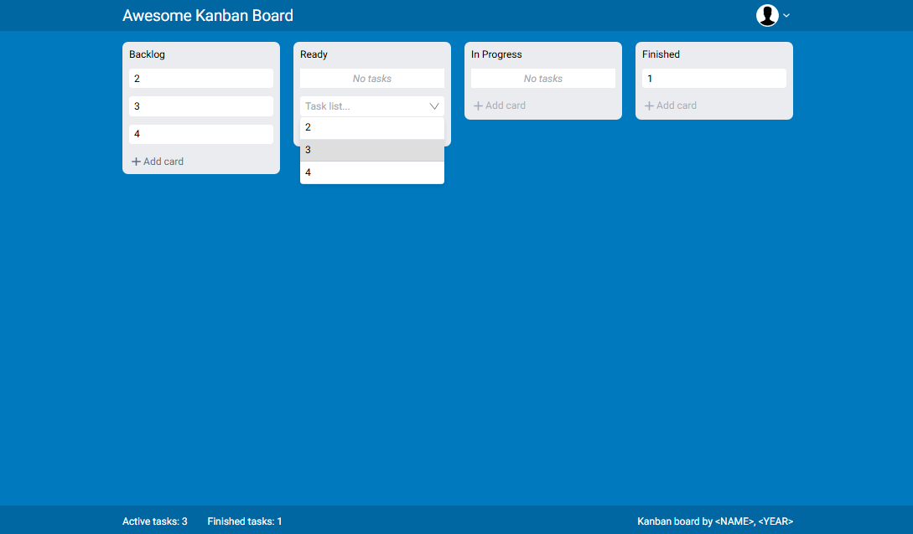

# Kanban_board_React_TS

 

### With:
:heavy_check_mark: HTML  
:heavy_check_mark: SCSS  
:heavy_check_mark: REACT  
:heavy_check_mark: TS  
:heavy_check_mark: Vite  
:heavy_check_mark: Responsive-Design 

### Without:
:x: Frameworks 
:x: Pixel-Perfect 

#### Original layout: *[Figma](https://www.figma.com/design/IzHoUNnpqSBdrwmRPTW8SW/Kanban-(Copy)?m=auto&t=Nw9B4qn0TaWlXky7-1)*
